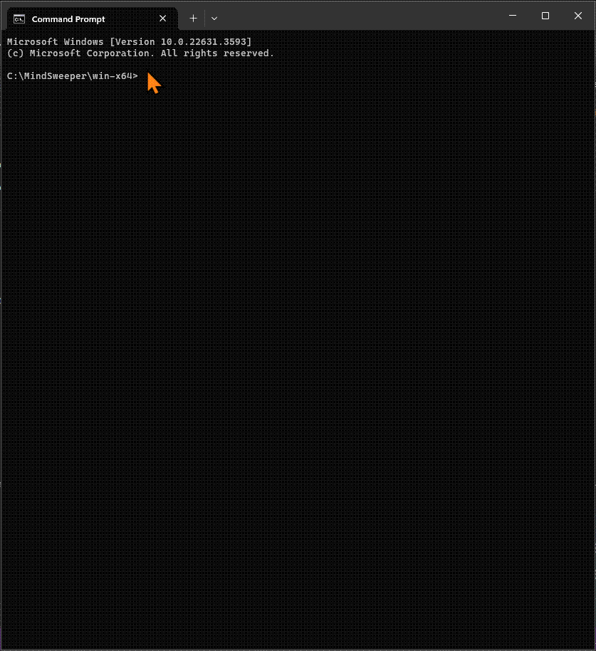

## Introduction

`Mind Sweeper` is game written in C# using .NET 8.0. It's a CLI console application played by issuing commands on a terminal and operating system of your choosing.

As a game it's not going to set the world on fire by any means whatsoever!

However, as a .NET engineer this project may provide you an excellent `experimental playground` for developers wishing to learn about writing modern .NET CLI applications using the new .NET [Command Line API](https://github.com/dotnet/command-line-api).

Being able to use the host builder to configure and run the CLI console app in just the same way as one does for web and web api projects, has been a really transformative experience. It makes it a real possibility to be able to easily add a CLI to an existing .NET app as well as developing them right from the get-go on green-field projects.

As a result of all this, I thought I would share this project to share the love for the good old `black screen white text`! Nb. other colour variations are available.

To read more about why I developed this code. See the [motivations for this project](#motivation-for-this-project).

## Quick Start

The *artifacts* folder in the root of this repository contains some `self-contained` executables of the game that target win-x64, osx-x64 and linux-x64. Download one and then open a terminal in the same folder and type `mindsweeper` (cmd), `.\mindsweeper.exe` (pwsh) or `./mindsweeper` (bash). This will display the help screen with further instructions on how to play.

## How to play

### Rules

The game is played on a grid of squares similar to a chess board. Unlike chess though, the player can only move one square at a time.

The player can move up, down, left, right, but not diagonally.

To win, the player must move from a square on the bottom row, to any square on the top row, without stepping on too many bombs.

Stepping on a bomb loses the player a life. Losing all their lives means they lose the game.

The playing field defaults to 8 rows by 8 columns, 64 squares and 21 bombs (i.e. 1 in 3 squares will explode!).  The player gets 3 lives. All these values are configurable via options for the `start` command. See the [Commands](#commands) section below for further information.

Just like a chess board each row on the playing field is numbered from 1 to 8 and each column is lettered from A to H, so each square is labelled according to it's row and column e.g. A1 to H1 and A1 to A8 etc.

Good luck!

### Commands

| Command | Description |
| :------ | :---------- |
| mindsweeper | Display welcome screen and help. |
| mindsweeper start [-r\|--rows] \<rows\> [-c\|--columns] \<columns\> [-b\|--bombs] \<bombs\> [-l\|--lives] \<lives\> | Start a new game with the optionally given number of rows [default: 8], columns [default: 8], bombs [default: 21], lives [default: 3] |
| mindsweeper move \<direction\> up \| down \| left \| right | Move from the current square in the given direction to another square. |
| mindsweeper status | Get the status of the current game. |
| mindsweeper end | End the current game. |

Nb. To display help on any of the above commands. Use one of the following options: -? | -h | --help

## Motivation for this project
In April 2024, a recruiter approached me on behalf of a company called [Schneider Electric](https://www.se.com/) who were looking for a C# developer.

They required that candidates undertake a technical test to create a console application, similar to Mine Sweeper, using best practises such as SOLID principles, unit testing and clean code etc.  The specification for the technical test is here: [Download](docs/Developer%20Coding%20Test%20-%20Minefield%20Game%20-%20Sept%202021.docx).

It was recommended that the test be completed within 2 hours.  For me personally, I felt that this was an unrealistic time frame to complete the test and do it justice. 

Despite this I decided to create a similar game in my own time. I felt inspired by the challenge and wanted to see if I could create a CLI version of the game rather than a simple console application that has a while loop listening for key inputs from the user.

For many years I have developed API and web applications that have a clear separation of concerns with the host sending commands and requests along a pipeline to an application layer containing CQRS behaviors, pre- and post-request processors and handlers thanks to the wonderful [Mediatr](https://github.com/jbogard/MediatR) package.

I wanted to prove I could build a CLI host application using a similar approach. It would also mean that in the future I could potentially build other host implementations, such as an API or Blazor front end, without any changes to the game logic.

In order to achieve this I looked at various command line parsers but settled on using the new dotnet [Command Line API](https://github.com/dotnet/command-line-api). Despite this still being in a pre-release state I was convinced it was viable due to it's wide adoption and integration with the dotnet host builder for dependency injection, logging, settings etc.  This was a crucial factor for me as it's essential to be able to create other host application flavours using exactly the same game logic.

